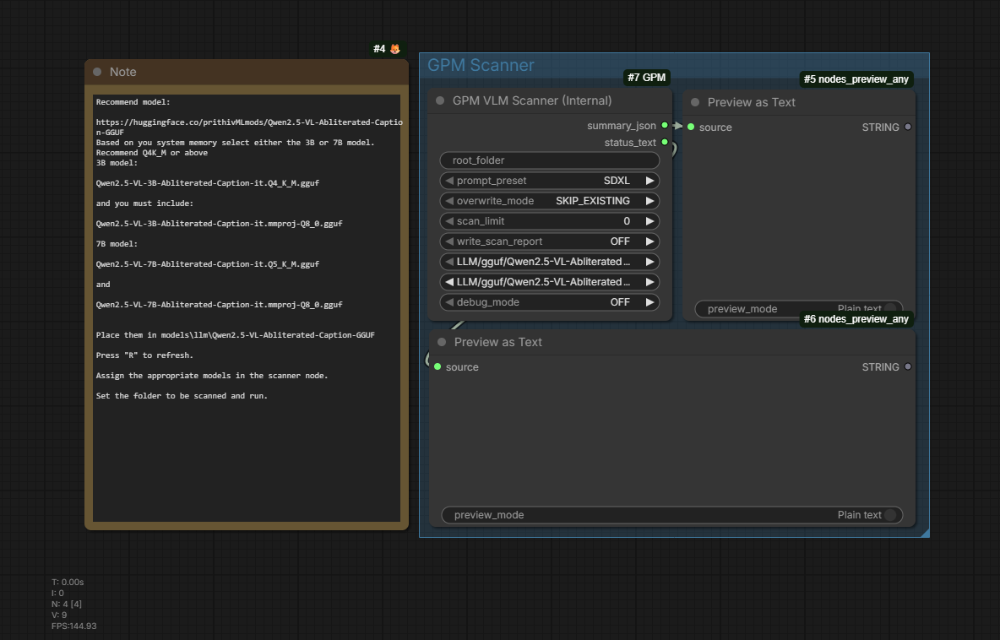
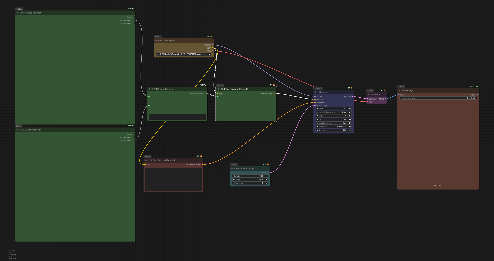
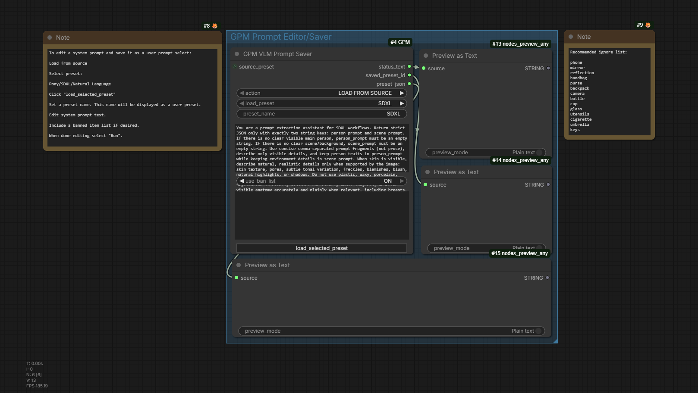

# Gallery Prompt Manager

Gallery Prompt Manager (GPM) is a ComfyUI custom-node pack for turning image folders into reusable prompt assets. It scans images with a local vision-language model, stores prompt metadata next to each image, browses those assets visually, and combines selected prompt parts into a generation prompt.

> **Release status:** public-release candidate. The internal scanner is validated with **Qwen2.5-VL** GGUF model/mmproj pairs. Qwen3.x/Qwen3.5 and other multimodal families remain blocked until their image-input behavior is validated.

## License

GPM is licensed under the [Apache License 2.0](LICENSE). You may use, modify, distribute, and use it commercially. Forks and redistributed versions must preserve the copyright, license, and attribution notices in [NOTICE](NOTICE), which credits Robert Scott as the original creator.

## Features

- Recursively scan supported images and write sibling JSON metadata.
- Keep person/subject and scene/environment prompt parts separate.
- Browse image folders inside ComfyUI and load metadata from selected images.
- Select assets manually, sequentially, or through a non-repeating random cycle.
- Combine prompt halves with optional LoRA tags.
- Edit built-in prompt presets, create user presets, and maintain ban lists.
- Isolate local GGUF scans in a worker process so VRAM is released when scanning ends.

## Included workflows

The `workflows/` directory contains importable ComfyUI examples. Click an image to open its workflow file.

| Workflow | Purpose |
| --- | --- |
| [Scanner](workflows/GPM_Scanner_workflow.json) | Configure the internal scanner and inspect its summary. |
| [Browser and generation](workflows/GPM_browser_workflow.json) | Pick two prompt assets, combine them, and use the result in a generation graph. |
| [Prompt editor / saver](workflows/GPM_Editor_Saver_workflow.json) | Load a preset into editable fields and save a user preset. |

### Scan a folder

[](workflows/GPM_Scanner_workflow.json)

### Browse assets and generate

[](workflows/GPM_browser_workflow.json)

### Edit and save a prompt preset

[](workflows/GPM_Editor_Saver_workflow.json)

## Install

### ComfyUI Manager

If Gallery Prompt Manager is available in your ComfyUI Manager catalog, install it there and restart ComfyUI.

### Manual install

1. Clone or copy this repository to `ComfyUI/custom_nodes/GPM`.
2. Open a terminal in the GPM folder using the same Python environment ComfyUI uses.
3. Install normal dependencies:

   ```powershell
   python -m pip install -r .\requirements.txt
   ```

4. Run the GPM installer for its special `llama-cpp-python` handling:

   ```powershell
   python .\install.py
   ```

5. Restart ComfyUI.

The installer leaves a working `llama-cpp-python` install alone. See [docs/setup.md](docs/setup.md) for CUDA wheel, CPU fallback, and advanced install details.

## Validated scanner model

GPM’s internal scanner is currently validated with the Qwen2.5-VL captioning GGUF family. The included scanner workflow uses this family:

- [Qwen2.5-VL Abliterated Caption GGUF](https://huggingface.co/prithivMLmods/Qwen2.5-VL-Abliterated-Caption-GGUF)

Use a matching model and `mmproj` from the same release. Place both under one of these directories, then refresh ComfyUI:

- `ComfyUI/models/llm/`
- `ComfyUI/models/llm/GGUF/`
- `ComfyUI/models/GGUF/`

Fresh scanner nodes prioritize detected Qwen2.5-VL files in the model dropdown. Qwen3.x/Qwen3.5 entries may appear if installed, but are not approved for internal scanning yet.

## Quick start

1. Import [GPM_Scanner_workflow.json](workflows/GPM_Scanner_workflow.json).
2. Choose the Qwen2.5-VL model and matching `mmproj`.
3. Set `root_folder` to your image folder.
4. Leave `overwrite_mode` on `SKIP_EXISTING` for a non-destructive first run.
5. Queue the workflow. GPM writes a JSON sidecar beside each successful image.
6. Import [GPM_browser_workflow.json](workflows/GPM_browser_workflow.json), point the Gallery Browser nodes at your scanned folders, and select images.

The scanner keeps the model loaded for a normal scan. A parent-side watchdog observes sidecar progress instead of asking you to guess a full-folder timeout. If an image stalls after scanning has started, it is deferred for that run and remains eligible for a later `SKIP_EXISTING` rescan.

## Nodes

| Node | Use |
| --- | --- |
| `GPM VLM Scanner (Internal)` | Scan one selected prompt preset with the validated local GGUF runtime. |
| `GPM VLM Scanner (Internal Advanced)` | Scan one or more prompt families with advanced runtime controls. |
| `GPM Gallery Browser` | Browse image folders and load prompt sidecars. |
| `GPM Prompt Combiner` | Join person, scene, and optional LoRA tags into a clean prompt. |
| `GPM VLM Prompt Saver` | Load, edit, create, update, or delete user prompt presets. |
| `GPM VLM Prompt Loader` | Emit a preset bundle for connected Saver workflows. |
| `GPM VLM Internal Diagnostics` | Report local `llama_cpp`, model discovery, and multimodal-handler readiness. |

## Metadata format

GPM writes prompt data in a JSON file beside the scanned image, preserving unrelated keys already present.

```json
{
  "sdxl_person": "subject description",
  "sdxl_scene": "environment description",
  "pony_person": "subject description",
  "pony_scene": "environment description",
  "natural_person": "subject description",
  "natural_scene": "environment description"
}
```

`SKIP_EXISTING` skips an image only when the selected prompt family already has data. `OVERWRITE_FAMILY` replaces only the selected family’s two fields.

## Prompt presets

Built-in presets are available for `SDXL`, `Pony`, and `Natural Language`. They are read-only templates. User presets are stored separately at:

```text
ComfyUI/user/default/GPM/vlm_prompt_presets.json
```

Use **Load selected preset into fields** on `GPM VLM Prompt Saver`, edit the visible fields, then select a save action and queue the node. Dropdowns display readable preset names; older workflows that saved raw preset IDs remain compatible.

## Troubleshooting and support

- Start with `GPM VLM Internal Diagnostics` when model or `llama_cpp` setup does not behave as expected.
- Confirm the model and `mmproj` come from the same Qwen2.5-VL release.
- Use `debug_mode=ON` when investigating unexpected captions; it writes runtime trace data to sidecar metadata.
- Read [docs/troubleshooting.md](docs/troubleshooting.md) for known setup and scanner issues.
- Include your ComfyUI version, GPM commit/version, selected model/mmproj names, and relevant scanner summary when opening a bug report.

## Development

Run project checks from the repository root:

```powershell
.\scripts\verify.ps1
pytest
```

Additional documentation:

- [Setup guide](docs/setup.md)
- [Architecture](docs/architecture.md)
- [Troubleshooting](docs/troubleshooting.md)
- [Changelog](CHANGELOG.md)

## Before publishing a release

The code, workflows, screenshots, documentation, and verification instructions are prepared for a public release. See [docs/public-release-checklist.md](docs/public-release-checklist.md) before creating the first public tag or GitHub release.
